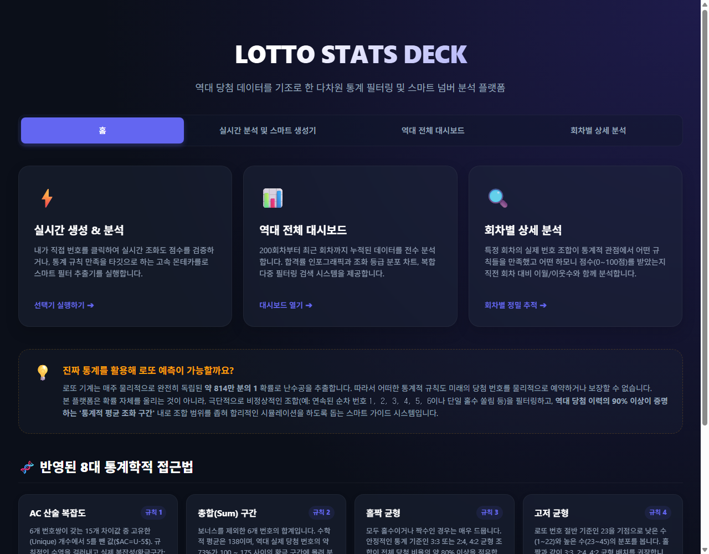

# 🎰 LOTTO GOLDEN RATIO (로또 황금 비율 플랫폼)

> **수학적 균형과 8대 통계적 필터링을 기반으로 로또 조합을 분석하고 생성하는 프리미엄 대시보드 플랫폼입니다.**

본 플랫폼은 동행복권 로또 6/45 데이터를 분석하여 극단적인 번호들을 배제하고, 역대 당첨 조합의 약 80% 이상이 집중되어 있는 **'황금 조화 구간'**의 조합을 검증 및 스마트 시뮬레이션으로 생성해 줍니다. 

* 🌐 **실시간 웹 서비스 주소**: [https://zaruous.github.io/lotto-golden-ratio/index.html](https://zaruous.github.io/lotto-golden-ratio/index.html)
* ⚡ **데이터베이스 인프라**: Supabase (PostgreSQL) Cloud DB 연동 완료
* 🤖 **자동화 파이프라인**: GitHub Actions을 활용한 주 3회 크론 스크래퍼 구동

---

## 📸 플랫폼 프리뷰 (Preview)

---

## ✨ 핵심 제공 기능

### 1. 실시간 분석 & 스마트 생성기 (Stats Deck)
* **몬테카를로 무작위 추출**: 필터 통과 조건(AC 복잡도, 홀짝 균형, 소수 개수 등)을 충족할 때까지 수만 번의 시뮬레이션을 실시간 수행해 최상의 황금비율 조합을 즉시 생성합니다.
* **하모니 스코어링**: 선택한 조합의 종합 점수를 100점 만점으로 환산하고 등급(황금조화/우수/보통/불균형)을 실시간 도출합니다.

### 2. 역대 전체 통계 분석 대시보드
* **핵심 통계 필터별 합격률**: 역대 200회부터의 당첨 번호가 각 통계적 기준(총합, AC, 홀짝, 고저, 소수, 3분할)을 얼마나 통과했는지 백분율로 표출합니다.
* **그라데이션 인포그래픽스**: 전체 데이터의 조화 등급별 점유율을 반응형 스택 바 및 컬러 매직 보드로 시각화합니다.

### 3. 회차별 정밀 상세 분석 (Inspector)
* **이월수 및 이웃수 추적**: 직전 당첨 번호 대비 중복 출현수(이월수) 및 직전 번호의 인접 번호 출현(이웃수)을 자동 대조 분석합니다.
* **회차별 연산 차트**: 선택 회차의 8대 핵심 필터 지표 통과율을 원형 다이얼 게이지 및 프로그레스 바 차트로 상세히 파헤칩니다.

---

## 📂 리포지토리 구성 파일 소개

본 프로젝트는 불필요한 프레임워크 의존성을 제거하고 브라우저가 직접 파싱하는 초고속 정적 자산(Vanilla Stack) 및 서버리스 환경으로 설계되었습니다.

| 파일명 | 용도 및 역할 |
| :--- | :--- |
| [**index.html**](index.html) | 플랫폼의 허브 역할을 하는 **인트로 웰컴 페이지**. 프리미엄 다크 네온 UX 디자인 적용. |
| [**LOTTO STATS DECK.html**](LOTTO%20STATS%20DECK.html) | 사용자 수동 조합 분석 및 **몬테카를로 조합 생성기** 화면. |
| [**역대통계분석.html**](역대통계분석.html) | 역대 전체 당첨 기록의 필터별 성공 비율 분석 및 필터링 검색 대시보드. |
| [**회차별상세분석.html**](회차별상세분석.html) | 특정 회차를 선택하여 이월/이웃/구간 분포를 차트로 보는 정밀 분석 도구. |
| [**supabase_config.js**](supabase_config.js) | Supabase Cloud Database 연동에 필요한 공개형 접속 URL 및 API Key 설정 파일. |
| [**fetch_lotto.js**](fetch_lotto.js) | 동행복권 API에서 최신 데이터를 긁어와 CSV 및 Supabase DB를 자동 갱신해 주는 스크립트. |
| [**migrate_to_supabase.js**](migrate_to_supabase.js) | 기존 로컬 CSV 데이터셋을 Supabase DB 테이블로 일괄 업로드하기 위한 최초 1회성 이관 스크립트. |
| [**lotto_history.csv**](lotto_history.csv) | 데이터베이스 연결 지연 시 활용되는 로컬 오프라인 데이터 백업 파일. |
| [**.github/workflows/update_lotto.yml**](.github/workflows/update_lotto.yml) | 매주 토/일요일 총 3회에 걸쳐 작동하도록 스케줄링된 GitHub Actions 워크플로우 명세. |
| [**design_guide.md**](design_guide.md) | 플랫폼의 일관된 글래스모피즘(Glassmorphic) 다크 테마 디자인 규격서. |

---

## 🚀 로컬 실행 방법

1. 저장소를 클론(Clone)하거나 Zip 파일로 내려받습니다.
2. 프로젝트 내 [supabase_config.js](supabase_config.js) 파일에 본인의 Supabase `Project URL`과 `Anon Key`를 작성해 줍니다.
3. [index.html](index.html) 파일을 브라우저로 열면 바로 실행됩니다.
   * *Tip: 만약 Supabase 키값을 빈 값으로 둘 경우, 자동으로 동일 폴더 내의 `lotto_history.csv` 파일을 인식하는 오프라인 안전 폴백(Fallback) 모드로 동작합니다.*